# 🚗 LUỒNG ĐĂNG KÝ XE HOÀN CHỈNH - END TO END

## 📊 TỔNG QUAN HỆ THỐNG

```
┌─────────────────────────────────────────────────────────────────────┐
│                     QHOME VEHICLE & BILLING SYSTEM                  │
├─────────────────────────────────────────────────────────────────────┤
│                                                                      │
│  [base-service]              [finance-billing-service]              │
│  ├── vehicles                ├── service_pricing                    │
│  ├── vehicle_registrations   ├── billing_cycles                     │
│  └── parking_pricing         ├── invoices                           │
│                              └── invoice_lines                       │
│                                                                      │
│  [iam-service]               [customer-interaction-service]         │
│  └── users, roles            └── notifications                      │
│                                                                      │
└─────────────────────────────────────────────────────────────────────┘
```

---

## 🔄 LUỒNG NGHIỆP VỤ HOÀN CHỈNH

### **Phase 1: ĐĂNG KÝ XE (Resident)**

```mermaid
sequenceDiagram
    participant R as Resident (App)
    participant V as VehicleService
    participant VR as VehicleRegistrationService
    participant M as Manager (Web)
    participant N as NotificationService
    
    R->>V: POST /api/vehicles (Tạo vehicle với active=false)
    V-->>R: 201 Created {vehicleId}
    
    R->>VR: POST /api/vehicle-registrations (Request đăng ký)
    Note over VR: Status: PENDING
    VR-->>R: 201 Created {registrationId}
    
    VR->>N: Gửi notification cho Manager
    N->>M: "Có yêu cầu đăng ký xe mới"
    
    M->>VR: GET /api/vehicle-registrations/pending
    VR-->>M: List pending requests
    
    alt Manager Approve
        M->>VR: POST /api/vehicle-registrations/{id}/approve
        VR->>V: Update vehicle.active = true
        VR->>N: Notify resident "Đã duyệt"
        VR-->>M: 200 OK
    else Manager Reject
        M->>VR: POST /api/vehicle-registrations/{id}/reject
        VR->>N: Notify resident "Từ chối"
        VR-->>M: 200 OK
    end
```



---

### **Phase 2: TÍNH PHÍ TỰ ĐỘNG (Scheduled Job)**

```mermaid
sequenceDiagram
    participant J as ScheduledJob
    participant BC as BillingCycleService
    participant V as VehicleService (base)
    participant I as InvoiceService
    participant DB as Database
    
    Note over J: Ngày 1 hàng tháng, 00:00
    
    J->>BC: createMonthlyBillingCycles()
    BC->>DB: INSERT billing_cycles
    
    J->>V: GET /api/vehicles/tenant/{id}/active
    V-->>J: List of active vehicles
    
    J->>I: generateParkingInvoices(vehicles)
    
    loop For each unit
        I->>DB: INSERT invoices
        loop For each vehicle
            I->>DB: INSERT invoice_lines
        end
    end
    
    I->>N: Send invoice notification
    N->>R: Email/SMS/Push notification
```



---

## 💻 CODE IMPLEMENTATION

### **1. base-service: Vehicle Registration Flow**

#### **A. VehicleController (Đã có)**

```java
@RestController
@RequestMapping("/api/vehicles")
@RequiredArgsConstructor
public class VehicleController {
    private final VehicleService vehicleService;

    @PostMapping
    @PreAuthorize("@authz.canCreateVehicle(#dto.tenantId())")
    public ResponseEntity<VehicleDto> createVehicle(@Valid @RequestBody VehicleCreateDto dto) {
        VehicleDto result = vehicleService.createVehicle(dto);
        return ResponseEntity.ok(result);
    }
    
    @GetMapping("/tenant/{tenantId}/active")
    @PreAuthorize("@authz.canViewVehiclesByTenant(#tenantId)")
    public ResponseEntity<List<VehicleDto>> getActiveVehiclesByTenantId(@PathVariable UUID tenantId) {
        List<VehicleDto> result = vehicleService.getActiveVehiclesByTenantId(tenantId);
        return ResponseEntity.ok(result);
    }
}
```

#### **B. VehicleRegistrationController (Đã có)**

```java
@RestController
@RequestMapping("/api/vehicle-registrations")
@RequiredArgsConstructor
public class VehicleRegistrationController {
    private final VehicleRegistrationService vehicleRegistrationService;

    @PostMapping
    @PreAuthorize("@authz.canCreateVehicleRegistration(#dto.tenantId())")
    public ResponseEntity<VehicleRegistrationDto> createRegistrationRequest(
            @Valid @RequestBody VehicleRegistrationCreateDto dto, 
            Authentication auth) {
        VehicleRegistrationDto result = vehicleRegistrationService.createRegistrationRequest(dto, auth);
        return ResponseEntity.ok(result);
    }

    @PostMapping("/{id}/approve")
    @PreAuthorize("@authz.canApproveVehicleRegistration(#id)")
    public ResponseEntity<VehicleRegistrationDto> approveRequest(
            @PathVariable UUID id, 
            @Valid @RequestBody VehicleRegistrationApproveDto dto, 
            Authentication auth) {
        VehicleRegistrationDto result = vehicleRegistrationService.approveRequest(id, dto, auth);
        return ResponseEntity.ok(result);
    }
}
```

#### **C. VehicleService Enhancement (Cần thêm)**

```java
@Service
@RequiredArgsConstructor
public class VehicleService {
    private final VehicleRepository vehicleRepository;
    private final ApplicationEventPublisher eventPublisher;
    
    @Transactional
    public VehicleDto activateVehicle(UUID vehicleId) {
        Vehicle vehicle = vehicleRepository.findById(vehicleId)
                .orElseThrow(() -> new IllegalArgumentException("Vehicle not found"));
        
        vehicle.setActive(true);
        vehicle.setUpdatedAt(nowUTC());
        Vehicle savedVehicle = vehicleRepository.save(vehicle);
        
        // Publish event for billing service
        eventPublisher.publishEvent(new VehicleActivatedEvent(
            savedVehicle.getId(),
            savedVehicle.getTenantId(),
            savedVehicle.getKind(),
            savedVehicle.getUnit() != null ? savedVehicle.getUnit().getId() : null,
            savedVehicle.getResident() != null ? savedVehicle.getResident().getId() : null
        ));
        
        return toDto(savedVehicle);
    }
}
```

---

### **2. finance-billing-service: Billing Implementation**

#### **A. Entity: ServicePricing**

```java
@Entity
@Table(schema = "billing", name = "service_pricing")
@Getter @Setter @Builder
@NoArgsConstructor @AllArgsConstructor
public class ServicePricing {
    @Id
    @GeneratedValue
    private UUID id;
    
    @Column(name = "tenant_id", nullable = false)
    private UUID tenantId;
    
    @Column(name = "service_code", nullable = false)
    private String serviceCode;  // PARKING_CAR, PARKING_MOTORBIKE, PARKING_BICYCLE
    
    @Column(name = "service_name", nullable = false)
    private String serviceName;
    
    @Column(name = "category")
    private String category;  // PARKING, UTILITIES, MAINTENANCE
    
    @Column(name = "base_price", nullable = false, precision = 14, scale = 4)
    private BigDecimal basePrice;
    
    @Column(name = "unit", nullable = false)
    private String unit;  // month, day, kWh, m3
    
    @Column(name = "tax_rate", nullable = false, precision = 5, scale = 2)
    @Builder.Default
    private BigDecimal taxRate = BigDecimal.ZERO;
    
    @Column(name = "effective_from", nullable = false)
    private LocalDate effectiveFrom;
    
    @Column(name = "effective_until")
    private LocalDate effectiveUntil;
    
    @Column(name = "active", nullable = false)
    @Builder.Default
    private Boolean active = true;
    
    @Column(name = "created_at", nullable = false)
    @Builder.Default
    private Instant createdAt = Instant.now();
    
    @Column(name = "updated_at", nullable = false)
    @Builder.Default
    private Instant updatedAt = Instant.now();
}
```

#### **B. Repository**

```java
public interface ServicePricingRepository extends JpaRepository<ServicePricing, UUID> {
    
    @Query("""
        SELECT sp FROM ServicePricing sp 
        WHERE sp.tenantId = :tenantId 
          AND sp.serviceCode = :serviceCode 
          AND sp.active = true
          AND :date BETWEEN sp.effectiveFrom AND COALESCE(sp.effectiveUntil, DATE '9999-12-31')
        ORDER BY sp.effectiveFrom DESC
        LIMIT 1
    """)
    Optional<ServicePricing> findCurrentPrice(
        @Param("tenantId") UUID tenantId,
        @Param("serviceCode") String serviceCode,
        @Param("date") LocalDate date
    );
    
    List<ServicePricing> findByTenantIdAndActiveTrue(UUID tenantId);
}
```

#### **C. DTO: VehicleParkingFeeDto**

```java
public record VehicleParkingFeeDto(
    UUID vehicleId,
    String plateNo,
    String vehicleKind,  // CAR, MOTORBIKE, BICYCLE
    UUID unitId,
    UUID residentId,
    BigDecimal monthlyPrice,
    BigDecimal dailyPrice,
    String description
) {
    public static VehicleParkingFeeDto from(
        UUID vehicleId,
        String plateNo, 
        String kind,
        UUID unitId,
        UUID residentId,
        ServicePricing pricing
    ) {
        String vehicleTypeName = switch (kind) {
            case "CAR" -> "ô tô";
            case "MOTORBIKE" -> "xe máy";
            case "BICYCLE" -> "xe đạp";
            default -> "xe khác";
        };
        
        return new VehicleParkingFeeDto(
            vehicleId,
            plateNo,
            kind,
            unitId,
            residentId,
            pricing.getBasePrice(),
            pricing.getBasePrice().divide(new BigDecimal("30"), 2, RoundingMode.HALF_UP),
            "Phí gửi xe " + vehicleTypeName + " - Biển số " + plateNo
        );
    }
}
```

#### **D. Service: ParkingBillingService**

```java
@Service
@Transactional
@RequiredArgsConstructor
@Slf4j
public class ParkingBillingService {
    
    private final InvoiceRepository invoiceRepository;
    private final InvoiceLineRepository invoiceLineRepository;
    private final BillingCycleRepository billingCycleRepository;
    private final ServicePricingRepository servicePricingRepository;
    private final RestTemplate restTemplate;
    
    @Value("${services.base-service.url}")
    private String baseServiceUrl;
    
    /**
     * Lấy danh sách xe active từ base-service
     */
    public List<VehicleDto> getActiveVehicles(UUID tenantId) {
        String url = baseServiceUrl + "/api/vehicles/tenant/" + tenantId + "/active";
        ResponseEntity<List<VehicleDto>> response = restTemplate.exchange(
            url,
            HttpMethod.GET,
            null,
            new ParameterizedTypeReference<>() {}
        );
        return response.getBody();
    }
    
    /**
     * Tính phí cho 1 xe
     */
    public Optional<VehicleParkingFeeDto> calculateFeeForVehicle(
        VehicleDto vehicle, 
        LocalDate billingDate
    ) {
        String serviceCode = "PARKING_" + vehicle.kind();
        
        return servicePricingRepository
            .findCurrentPrice(vehicle.tenantId(), serviceCode, billingDate)
            .map(pricing -> VehicleParkingFeeDto.from(
                vehicle.id(),
                vehicle.plateNo(),
                vehicle.kind(),
                vehicle.unitId(),
                vehicle.residentId(),
                pricing
            ));
    }
    
    /**
     * Tính phí pro-rata khi đăng ký giữa tháng
     */
    public BigDecimal calculateProRataFee(
        BigDecimal monthlyPrice,
        LocalDate registrationDate,
        LocalDate periodEnd
    ) {
        int daysInMonth = periodEnd.lengthOfMonth();
        int remainingDays = ChronoUnit.DAYS.between(registrationDate, periodEnd) + 1;
        
        BigDecimal dailyRate = monthlyPrice.divide(
            new BigDecimal(daysInMonth), 
            4, 
            RoundingMode.HALF_UP
        );
        
        return dailyRate.multiply(new BigDecimal(remainingDays))
            .setScale(0, RoundingMode.HALF_UP);
    }
    
    /**
     * Tạo hóa đơn phí gửi xe cho tất cả xe active
     */
    public List<Invoice> generateMonthlyParkingInvoices(
        UUID tenantId, 
        UUID cycleId
    ) {
        BillingCycle cycle = billingCycleRepository.findById(cycleId)
            .orElseThrow(() -> new IllegalArgumentException("Billing cycle not found"));
        
        // 1. Lấy danh sách xe active
        List<VehicleDto> vehicles = getActiveVehicles(tenantId);
        log.info("Found {} active vehicles for tenant {}", vehicles.size(), tenantId);
        
        // 2. Tính phí cho từng xe
        List<VehicleParkingFeeDto> fees = vehicles.stream()
            .map(v -> calculateFeeForVehicle(v, cycle.getPeriodFrom()))
            .filter(Optional::isPresent)
            .map(Optional::get)
            .toList();
        
        // 3. Group by unit
        Map<UUID, List<VehicleParkingFeeDto>> feesByUnit = fees.stream()
            .filter(fee -> fee.unitId() != null)
            .collect(Collectors.groupingBy(VehicleParkingFeeDto::unitId));
        
        // 4. Tạo invoice cho mỗi unit
        List<Invoice> invoices = new ArrayList<>();
        
        for (Map.Entry<UUID, List<VehicleParkingFeeDto>> entry : feesByUnit.entrySet()) {
            UUID unitId = entry.getKey();
            List<VehicleParkingFeeDto> unitFees = entry.getValue();
            
            // Tạo invoice
            Invoice invoice = createInvoice(
                tenantId, 
                cycleId, 
                unitId, 
                unitFees.get(0).residentId(),
                cycle.getPeriodFrom()
            );
            invoice = invoiceRepository.save(invoice);
            
            // Tạo invoice lines
            for (VehicleParkingFeeDto fee : unitFees) {
                InvoiceLine line = createInvoiceLine(invoice, fee, cycle.getPeriodFrom());
                invoiceLineRepository.save(line);
            }
            
            invoices.add(invoice);
            log.info("Created invoice {} for unit {} with {} vehicles", 
                invoice.getCode(), unitId, unitFees.size());
        }
        
        return invoices;
    }
    
    /**
     * Tạo invoice cho xe đăng ký giữa tháng (pro-rata)
     */
    public Invoice createProRataInvoice(
        UUID tenantId,
        UUID vehicleId,
        LocalDate registrationDate
    ) {
        // 1. Lấy thông tin xe
        VehicleDto vehicle = getVehicleById(vehicleId);
        
        // 2. Tìm hoặc tạo billing cycle hiện tại
        LocalDate periodStart = registrationDate.withDayOfMonth(1);
        LocalDate periodEnd = registrationDate.withDayOfMonth(registrationDate.lengthOfMonth());
        
        BillingCycle cycle = billingCycleRepository
            .findByTenantIdAndPeriodFromAndPeriodTo(tenantId, periodStart, periodEnd)
            .orElseGet(() -> createBillingCycle(tenantId, periodStart, periodEnd));
        
        // 3. Tính phí pro-rata
        VehicleParkingFeeDto fee = calculateFeeForVehicle(vehicle, registrationDate)
            .orElseThrow(() -> new IllegalStateException("No pricing found for vehicle type"));
        
        BigDecimal proRataAmount = calculateProRataFee(
            fee.monthlyPrice(), 
            registrationDate, 
            periodEnd
        );
        
        // 4. Tạo invoice
        Invoice invoice = createInvoice(
            tenantId, 
            cycle.getId(), 
            vehicle.unitId(), 
            vehicle.residentId(),
            registrationDate
        );
        invoice = invoiceRepository.save(invoice);
        
        // 5. Tạo invoice line với số ngày pro-rata
        int remainingDays = (int) ChronoUnit.DAYS.between(registrationDate, periodEnd) + 1;
        
        InvoiceLine line = InvoiceLine.builder()
            .tenantId(tenantId)
            .invoiceId(invoice.getId())
            .serviceDate(registrationDate)
            .description(fee.description() + " (Pro-rata " + 
                registrationDate.getDayOfMonth() + "-" + periodEnd.getDayOfMonth() + "/" + 
                registrationDate.getMonthValue() + ")")
            .quantity(new BigDecimal(remainingDays))
            .unit("ngày")
            .unitPrice(fee.dailyPrice())
            .taxRate(BigDecimal.ZERO)
            .taxAmount(BigDecimal.ZERO)
            .serviceCode("PARKING_" + vehicle.kind())
            .externalRefType("VEHICLE")
            .externalRefId(vehicleId.toString())
            .build();
        
        invoiceLineRepository.save(line);
        
        log.info("Created pro-rata invoice {} for vehicle {} ({} days, {} VND)", 
            invoice.getCode(), vehicleId, remainingDays, proRataAmount);
        
        return invoice;
    }
    
    private Invoice createInvoice(
        UUID tenantId, 
        UUID cycleId, 
        UUID unitId, 
        UUID residentId,
        LocalDate serviceDate
    ) {
        String code = generateInvoiceCode(tenantId, serviceDate);
        LocalDate dueDate = serviceDate.plusDays(15);
        
        return Invoice.builder()
            .tenantId(tenantId)
            .code(code)
            .issuedAt(Instant.now())
            .dueDate(dueDate)
            .status(InvStatus.PUBLISHED)
            .currency("VND")
            .payerUnitId(unitId)
            .payerResidentId(residentId)
            .cycleId(cycleId)
            .build();
    }
    
    private InvoiceLine createInvoiceLine(
        Invoice invoice, 
        VehicleParkingFeeDto fee,
        LocalDate serviceDate
    ) {
        return InvoiceLine.builder()
            .tenantId(invoice.getTenantId())
            .invoiceId(invoice.getId())
            .serviceDate(serviceDate)
            .description(fee.description() + " (" + 
                serviceDate.getMonth() + "/" + serviceDate.getYear() + ")")
            .quantity(BigDecimal.ONE)
            .unit("tháng")
            .unitPrice(fee.monthlyPrice())
            .taxRate(BigDecimal.ZERO)
            .taxAmount(BigDecimal.ZERO)
            .serviceCode("PARKING_" + fee.vehicleKind())
            .externalRefType("VEHICLE")
            .externalRefId(fee.vehicleId().toString())
            .build();
    }
    
    private String generateInvoiceCode(UUID tenantId, LocalDate date) {
        String prefix = "INV-" + date.format(DateTimeFormatter.ofPattern("yyyyMM"));
        long count = invoiceRepository.countByTenantIdAndCodeStartingWith(tenantId, prefix);
        return prefix + "-" + String.format("%04d", count + 1);
    }
}
```

#### **E. Scheduled Job: Monthly Billing**

```java
@Component
@RequiredArgsConstructor
@Slf4j
public class MonthlyBillingScheduler {
    
    private final BillingCycleService billingCycleService;
    private final ParkingBillingService parkingBillingService;
    private final TenantRepository tenantRepository;
    
    /**
     * Chạy vào 00:00 ngày 1 hàng tháng
     */
    @Scheduled(cron = "0 0 0 1 * ?")
    @Transactional
    public void generateMonthlyBillingCycles() {
        log.info("Starting monthly billing cycle generation...");
        
        LocalDate today = LocalDate.now();
        LocalDate periodStart = today.withDayOfMonth(1);
        LocalDate periodEnd = today.withDayOfMonth(today.lengthOfMonth());
        
        List<Tenant> tenants = tenantRepository.findAllByActiveTrue();
        
        for (Tenant tenant : tenants) {
            try {
                // 1. Tạo billing cycle
                BillingCycle cycle = billingCycleService.createMonthlyC cycle(
                    tenant.getId(),
                    "Tháng " + today.format(DateTimeFormatter.ofPattern("MM/yyyy")),
                    periodStart,
                    periodEnd
                );
                
                // 2. Tạo hóa đơn phí gửi xe
                List<Invoice> parkingInvoices = parkingBillingService
                    .generateMonthlyParkingInvoices(tenant.getId(), cycle.getId());
                
                log.info("Generated {} parking invoices for tenant {} (cycle {})", 
                    parkingInvoices.size(), tenant.getName(), cycle.getId());
                
            } catch (Exception e) {
                log.error("Failed to generate billing for tenant {}: {}", 
                    tenant.getName(), e.getMessage(), e);
            }
        }
        
        log.info("Completed monthly billing cycle generation");
    }
}
```

---

### **3. Integration: Event-Driven Communication**

#### **A. VehicleActivatedEvent**

```java
@Getter
@AllArgsConstructor
public class VehicleActivatedEvent {
    private UUID vehicleId;
    private UUID tenantId;
    private String vehicleKind;
    private UUID unitId;
    private UUID residentId;
    private LocalDate activatedDate;
}
```

#### **B. Event Listener in finance-billing-service**

```java
@Component
@RequiredArgsConstructor
@Slf4j
public class VehicleEventListener {
    
    private final ParkingBillingService parkingBillingService;
    
    @EventListener
    @Transactional
    public void handleVehicleActivated(VehicleActivatedEvent event) {
        log.info("Vehicle activated: {}", event.getVehicleId());
        
        LocalDate activatedDate = event.getActivatedDate();
        LocalDate today = LocalDate.now();
        
        // Nếu kích hoạt sau ngày 5 trong tháng → Tạo pro-rata invoice
        if (activatedDate.getDayOfMonth() > 5) {
            try {
                Invoice invoice = parkingBillingService.createProRataInvoice(
                    event.getTenantId(),
                    event.getVehicleId(),
                    activatedDate
                );
                
                log.info("Created pro-rata invoice {} for vehicle {}", 
                    invoice.getCode(), event.getVehicleId());
                    
            } catch (Exception e) {
                log.error("Failed to create pro-rata invoice: {}", e.getMessage(), e);
            }
        } else {
            log.info("Vehicle activated early in month, will be included in next monthly billing");
        }
    }
}
```

---

## 📱 API ENDPOINTS SUMMARY

### **base-service**

```http
### 1. Tạo xe mới (resident)
POST /api/vehicles
Authorization: Bearer {token}
{
  "tenantId": "uuid",
  "residentId": "uuid",
  "unitId": "uuid",
  "plateNo": "29A-12345",
  "kind": "CAR",
  "color": "Đen"
}

### 2. Tạo yêu cầu đăng ký
POST /api/vehicle-registrations
{
  "tenantId": "uuid",
  "vehicleId": "uuid",
  "reason": "Đăng ký xe mới"
}

### 3. Manager approve
POST /api/vehicle-registrations/{id}/approve
{
  "note": "Đã xác minh"
}

### 4. Lấy danh sách xe active (cho billing service)
GET /api/vehicles/tenant/{tenantId}/active
```

### **finance-billing-service**

```http
### 1. Tạo billing cycle tháng
POST /api/billing-cycles
{
  "tenantId": "uuid",
  "name": "Tháng 11/2024",
  "periodFrom": "2024-11-01",
  "periodTo": "2024-11-30"
}

### 2. Tạo hóa đơn phí gửi xe (auto)
POST /api/billing/parking-invoices/generate
{
  "tenantId": "uuid",
  "cycleId": "uuid"
}

### 3. Lấy hóa đơn của resident
GET /api/invoices?residentId={uuid}&status=PUBLISHED

### 4. Thanh toán hóa đơn
POST /api/payments
{
  "invoiceId": "uuid",
  "amount": 500000,
  "method": "BANK_TRANSFER"
}
```

---

## ✅ CHECKLIST TRIỂN KHAI

### **Phase 1: Base Service (ĐÃ XONG ✅)**
- [x] Vehicle entity & repository
- [x] VehicleRegistration entity & repository
- [x] VehicleService (CRUD + activate)
- [x] VehicleRegistrationService (approve/reject/cancel)
- [x] Controllers với @PreAuthorize
- [x] GlobalExceptionHandler

### **Phase 2: Finance Service (CẦN LÀM)**
- [ ] ServicePricing entity & repository
- [ ] Invoice & InvoiceLine entities (đã có schema)
- [ ] ParkingBillingService
- [ ] Scheduled job tạo billing cycle
- [ ] Scheduled job tính phí trễ hạn
- [ ] REST API endpoints

### **Phase 3: Integration (CẦN LÀM)**
- [ ] Event-driven communication (hoặc REST call)
- [ ] Pro-rata billing khi đăng ký giữa tháng
- [ ] Notification service integration

### **Phase 4: Testing**
- [ ] Unit tests
- [ ] Integration tests
- [ ] End-to-end testing
- [ ] Load testing

---

## 🎯 NEXT STEPS

**Bạn muốn tôi implement phần nào trước?**

1. ✅ **finance-billing-service Entities** (ServicePricing, Invoice, InvoiceLine)
2. ✅ **ParkingBillingService** (Business logic)
3. ✅ **Scheduled Jobs** (Monthly billing, Late fees)
4. ✅ **REST Controllers** (API endpoints)
5. ✅ **Integration Tests** (End-to-end flow)

**Tôi sẽ bắt đầu với option 1 - Tạo Entities!** 🚀


