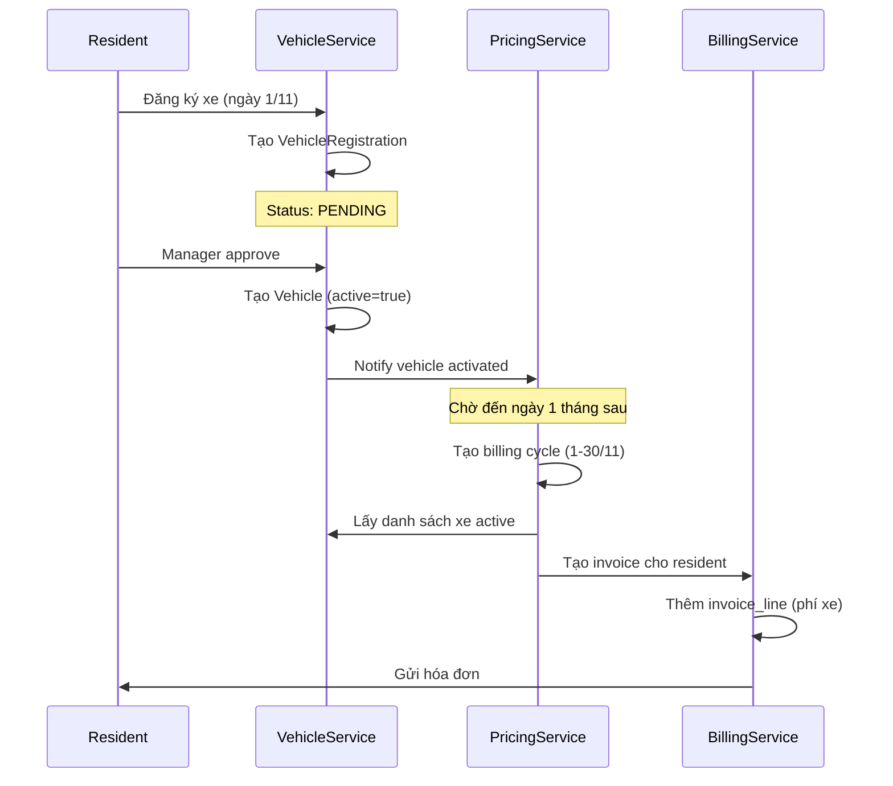

# 🚗 Quy Trình Thu Phí Gửi Xe - Hướng Dẫn Chi Tiết

## 📊 CÁC MÔ HÌNH THU PHÍ

### 1. Thu Phí Theo Tháng (RECOMMENDED ✅)
**Ưu điểm:**
- ✅ Đơn giản, dễ quản lý
- ✅ Resident biết trước chi phí cố định
- ✅ Tự động hóa dễ dàng
- ✅ Ổn định dòng tiền cho BQL

**Nhược điểm:**
- ❌ Không linh hoạt với xe thay đổi giữa tháng
- ❌ Cần xử lý pro-rata khi đăng ký/hủy giữa kỳ

**Áp dụng cho:** Chung cư, tòa nhà văn phòng

---

### 2. Thu Phí Theo Lượt Ra Vào
**Ưu điểm:**
- ✅ Công bằng (trả theo mức sử dụng)
- ✅ Phù hợp bãi xe công cộng

**Nhược điểm:**
- ❌ Phức tạp, cần hệ thống barrier/camera
- ❌ Chi phí đầu tư cao
- ❌ Khó dự đoán doanh thu

**Áp dụng cho:** Bãi xe thương mại, sân bay

---

### 3. Thu Phí Một Lần (Deposit)
**Ưu điểm:**
- ✅ Đảm bảo commitment
- ✅ Giảm churn rate

**Nhược điểm:**
- ❌ Resident phản đối khoản phí lớn ban đầu
- ❌ Cần xử lý hoàn trả khi hết hợp đồng

**Áp dụng cho:** Kết hợp với phí tháng như "phí đặt cọc"

---

## 🎯 ĐỀ XUẤT: MÔ HÌNH KẾT HỢP

### **A. Phí Đăng Ký Ban Đầu (One-time)**
- Phí xử lý hồ sơ: 50,000 VND/xe
- Phí thẻ xe: 100,000 VND/thẻ (hoàn lại khi trả thẻ)

### **B. Phí Gửi Xe Hàng Tháng (Recurring)**
```
- Ô tô:       500,000 - 1,000,000 VND/tháng
- Xe máy:     100,000 - 200,000 VND/tháng  
- Xe đạp:     50,000 - 100,000 VND/tháng
```

### **C. Phí Pro-rata (Đăng ký giữa tháng)**
```
Phí = (Phí tháng / Số ngày trong tháng) × Số ngày còn lại
```

---

## 🔄 QUY TRÌNH THU PHÍ CHI TIẾT

### **TIMELINE - Chu kỳ tháng**

```
Ngày 1-5:   Tạo hóa đơn tự động
Ngày 10:    Gửi nhắc nhở thanh toán
Ngày 15:    Hạn cuối thanh toán
Ngày 16:    Bắt đầu tính phí trễ hạn
Ngày 30:    Khoá thẻ xe nếu chưa thanh toán
```

---

## 📝 LUỒNG NGHIỆP VỤ

### **Scenario 1: Đăng Ký Xe Mới (Đầu Tháng)**



**SQL Implementation:**

```sql
-- 1. Resident đăng ký xe vào ngày 5/11
INSERT INTO data.vehicle_registration_requests (
    tenant_id, vehicle_id, reason, status, requested_by, requested_at
)
VALUES (
    '{tenant_id}',
    '{vehicle_id}',
    'Đăng ký mới',
    'PENDING',
    '{resident_user_id}',
    '2024-11-05 10:00:00'
);

-- 2. Manager approve ngày 6/11
UPDATE data.vehicle_registration_requests
SET status = 'APPROVED',
    approved_by = '{manager_user_id}',
    approved_at = '2024-11-06 14:00:00'
WHERE id = '{registration_id}';

-- 3. Tạo vehicle (active)
UPDATE data.vehicles
SET active = true
WHERE id = '{vehicle_id}';

-- 4. Ngày 1/12, tạo billing cycle
INSERT INTO billing.billing_cycles (tenant_id, name, period_from, period_to, status)
VALUES (
    '{tenant_id}',
    'Tháng 12/2024',
    '2024-12-01',
    '2024-12-31',
    'OPEN'
);

-- 5. Tạo invoice cho resident
INSERT INTO billing.invoices (
    tenant_id, code, due_date, status, payer_unit_id, cycle_id
)
SELECT 
    v.tenant_id,
    'INV-' || TO_CHAR(NOW(), 'YYYYMM') || '-' || LPAD(NEXTVAL('invoice_seq')::TEXT, 4, '0'),
    '2024-12-15',
    'PUBLISHED',
    v.unit_id,
    '{cycle_id}'
FROM data.vehicles v
WHERE v.id = '{vehicle_id}';

-- 6. Tạo invoice line cho phí gửi xe
INSERT INTO billing.invoice_lines (
    tenant_id, invoice_id, service_date, description, 
    quantity, unit, unit_price, service_code, 
    external_ref_type, external_ref_id
)
SELECT 
    v.tenant_id,
    '{invoice_id}',
    '2024-12-01',
    'Phí gửi xe ' || 
        CASE v.kind 
            WHEN 'CAR' THEN 'ô tô'
            WHEN 'MOTORBIKE' THEN 'xe máy'
        END || ' - Biển số ' || v.plate_no,
    1,
    'tháng',
    sp.base_price,
    'PARKING_' || v.kind,
    'VEHICLE',
    v.id::text
FROM data.vehicles v
JOIN billing.service_pricing sp 
    ON sp.service_code = 'PARKING_' || v.kind
    AND sp.tenant_id = v.tenant_id
    AND sp.active = true
    AND '2024-12-01' BETWEEN sp.effective_from 
        AND COALESCE(sp.effective_until, '9999-12-31')
WHERE v.id = '{vehicle_id}';
```

---

### **Scenario 2: Đăng Ký Xe Giữa Tháng (Pro-rata)**

```sql
-- Resident đăng ký xe ngày 15/11 (còn 16 ngày trong tháng 30 ngày)
-- Tính phí: (500,000 / 30) * 16 = 266,667 VND

-- 1. Tạo invoice ngay khi approve (không chờ đến tháng sau)
WITH pricing AS (
    SELECT base_price
    FROM billing.service_pricing
    WHERE tenant_id = '{tenant_id}'
      AND service_code = 'PARKING_CAR'
      AND active = true
      AND '2024-11-15' BETWEEN effective_from 
          AND COALESCE(effective_until, '9999-12-31')
),
pro_rata AS (
    SELECT 
        (SELECT base_price FROM pricing) AS monthly_price,
        EXTRACT(DAY FROM DATE '2024-11-30') AS days_in_month,
        EXTRACT(DAY FROM DATE '2024-11-30') - EXTRACT(DAY FROM DATE '2024-11-15') + 1 AS remaining_days
)
INSERT INTO billing.invoice_lines (
    tenant_id, invoice_id, service_date, description,
    quantity, unit, unit_price, service_code,
    external_ref_type, external_ref_id
)
SELECT 
    '{tenant_id}',
    '{invoice_id}',
    '2024-11-15',
    'Phí gửi xe ô tô (Pro-rata 15-30/11) - Biển số 29A-12345',
    pr.remaining_days,
    'ngày',
    ROUND(pr.monthly_price / pr.days_in_month, 0),
    'PARKING_CAR',
    'VEHICLE',
    '{vehicle_id}'
FROM pro_rata pr;

-- Kết quả: 16 ngày × 16,667 VND/ngày = 266,672 VND
```

---

### **Scenario 3: Hủy Xe Giữa Tháng (Hoàn Tiền)**

```sql
-- Resident hủy xe ngày 20/11 (đã thanh toán full tháng 500k)
-- Hoàn lại: (500,000 / 30) * 10 ngày = 166,667 VND

-- 1. Soft delete vehicle
UPDATE data.vehicles
SET active = false,
    updated_at = '2024-11-20 10:00:00'
WHERE id = '{vehicle_id}';

-- 2. Tạo adjustment để giảm tiền (credit)
WITH refund_calc AS (
    SELECT 
        il.id AS invoice_line_id,
        il.invoice_id,
        il.unit_price * il.quantity AS paid_amount,
        EXTRACT(DAY FROM DATE '2024-11-30') AS days_in_month,
        EXTRACT(DAY FROM DATE '2024-11-30') - EXTRACT(DAY FROM DATE '2024-11-20') AS unused_days
)
INSERT INTO billing.invoice_adjustments (
    tenant_id, invoice_id, adjustment_type, amount, reason, created_by
)
SELECT 
    '{tenant_id}',
    rc.invoice_id,
    'REFUND',
    -ROUND((rc.paid_amount / rc.days_in_month) * rc.unused_days, 0),  -- Số âm
    'Hoàn tiền hủy xe giữa tháng (20-30/11)',
    '{manager_user_id}'
FROM refund_calc rc;

-- Kết quả: -166,667 VND adjustment

-- 3. Hoặc tạo refund request (nếu đã thanh toán)
INSERT INTO finance.refunds (
    tenant_id, payment_id, refund_no, refund_amount, 
    reason, status, requested_by
)
VALUES (
    '{tenant_id}',
    '{payment_id}',
    'REF-' || TO_CHAR(NOW(), 'YYYYMMDD') || '-001',
    166667,
    'Hủy xe giữa tháng - hoàn tiền 10 ngày chưa sử dụng',
    'PENDING',
    '{resident_user_id}'
);
```

---

### **Scenario 4: Tự Động Hóa - Monthly Billing Job**

```sql
-- SCHEDULED JOB: Chạy vào 00:00 ngày 1 hàng tháng

-- Step 1: Tạo billing cycle
DO $$
DECLARE
    cycle_id UUID;
    tenant_rec RECORD;
BEGIN
    FOR tenant_rec IN (SELECT DISTINCT tenant_id FROM data.tenants WHERE active = true)
    LOOP
        INSERT INTO billing.billing_cycles (tenant_id, name, period_from, period_to, status)
        VALUES (
            tenant_rec.tenant_id,
            'Tháng ' || TO_CHAR(CURRENT_DATE, 'MM/YYYY'),
            DATE_TRUNC('month', CURRENT_DATE),
            (DATE_TRUNC('month', CURRENT_DATE) + INTERVAL '1 month' - INTERVAL '1 day')::DATE,
            'OPEN'
        )
        RETURNING id INTO cycle_id;

        -- Step 2: Tạo invoice cho từng unit có xe
        INSERT INTO billing.invoices (
            tenant_id, code, due_date, status, 
            payer_unit_id, payer_resident_id, cycle_id
        )
        SELECT DISTINCT
            v.tenant_id,
            'INV-' || TO_CHAR(CURRENT_DATE, 'YYYYMM') || '-' || 
                LPAD(ROW_NUMBER() OVER (ORDER BY v.unit_id)::TEXT, 4, '0'),
            CURRENT_DATE + INTERVAL '15 days',
            'PUBLISHED',
            v.unit_id,
            v.resident_id,
            cycle_id
        FROM data.vehicles v
        WHERE v.tenant_id = tenant_rec.tenant_id
          AND v.active = true
          AND v.unit_id IS NOT NULL;

        -- Step 3: Tạo invoice lines cho từng xe
        INSERT INTO billing.invoice_lines (
            tenant_id, invoice_id, service_date, description,
            quantity, unit, unit_price, service_code,
            external_ref_type, external_ref_id
        )
        SELECT 
            v.tenant_id,
            i.id,
            CURRENT_DATE,
            'Phí gửi xe ' || 
                CASE v.kind 
                    WHEN 'CAR' THEN 'ô tô'
                    WHEN 'MOTORBIKE' THEN 'xe máy'
                    WHEN 'BICYCLE' THEN 'xe đạp'
                    ELSE 'khác'
                END || ' - Biển số ' || v.plate_no || 
                ' (' || TO_CHAR(CURRENT_DATE, 'MM/YYYY') || ')',
            1,
            'tháng',
            sp.base_price,
            'PARKING_' || v.kind,
            'VEHICLE',
            v.id::text
        FROM data.vehicles v
        JOIN billing.invoices i 
            ON i.payer_unit_id = v.unit_id
            AND i.cycle_id = cycle_id
        JOIN billing.service_pricing sp 
            ON sp.service_code = 'PARKING_' || v.kind
            AND sp.tenant_id = v.tenant_id
            AND sp.active = true
            AND CURRENT_DATE BETWEEN sp.effective_from 
                AND COALESCE(sp.effective_until, '9999-12-31')
        WHERE v.tenant_id = tenant_rec.tenant_id
          AND v.active = true;

    END LOOP;
END $$;
```

---

## 💳 XỬ LÝ THANH TOÁN

### **1. Resident Thanh Toán Online**

```sql
-- Bước 1: Tạo payment intent
INSERT INTO finance.payment_intents (
    tenant_id, intent_key, amount_total, 
    payer_resident_id, description
)
VALUES (
    '{tenant_id}',
    'INTENT-' || gen_random_uuid(),
    500000,  -- Tổng tiền các invoice muốn thanh toán
    '{resident_id}',
    'Thanh toán phí gửi xe tháng 11/2024'
);

-- Bước 2: Link invoice vào intent
INSERT INTO finance.payment_intent_targets (
    tenant_id, intent_id, target_type, 
    invoice_id, amount_planned
)
VALUES (
    '{tenant_id}',
    '{intent_id}',
    'INVOICE',
    '{invoice_id}',
    500000
);

-- Bước 3: Tạo payment attempt (gọi MoMo/VNPay)
INSERT INTO finance.payment_attempts (
    tenant_id, intent_id, gateway_id, 
    method, amount_expected, ext_order_id, pay_url
)
VALUES (
    '{tenant_id}',
    '{intent_id}',
    '{momo_gateway_id}',
    'MOMO',
    500000,
    'ORDER-' || TO_CHAR(NOW(), 'YYYYMMDDHHMMSS'),
    'https://payment.momo.vn/...'
);

-- Bước 4: Khi webhook callback (payment success)
INSERT INTO finance.payments (
    tenant_id, receipt_no, method, 
    amount_total, status, payer_resident_id
)
VALUES (
    '{tenant_id}',
    'PAY-' || TO_CHAR(NOW(), 'YYYYMMDD') || '-001',
    'MOMO',
    500000,
    'SUCCEEDED',
    '{resident_id}'
);

-- Bước 5: Phân bổ vào invoice
INSERT INTO finance.payment_allocations (
    tenant_id, payment_id, allocation_type, 
    invoice_id, amount
)
VALUES (
    '{tenant_id}',
    '{payment_id}',
    'INVOICE',
    '{invoice_id}',
    500000
);

-- Bước 6: Update invoice status
UPDATE billing.invoices
SET status = 'PAID'
WHERE id = '{invoice_id}';

-- Bước 7: Ghi sổ cái
-- ... (xem phần trước)
```

---

### **2. Resident Thanh Toán Tiền Mặt (Tại văn phòng)**

```sql
-- Bước 1: Nhân viên tạo payment
INSERT INTO finance.payments (
    tenant_id, receipt_no, method, cash_account_id,
    amount_total, status, payer_resident_id
)
VALUES (
    '{tenant_id}',
    'CASH-' || TO_CHAR(NOW(), 'YYYYMMDD') || '-' || 
        LPAD(NEXTVAL('cash_receipt_seq')::TEXT, 4, '0'),
    'CASH',
    '{cash_account_id}',  -- Tài khoản tiền mặt
    500000,
    'SUCCEEDED',
    '{resident_id}'
);

-- Bước 2-6: Giống như thanh toán online

-- Bước 7: Cập nhật cash account
UPDATE finance.cash_accounts
SET current_balance = current_balance + 500000,
    updated_at = NOW()
WHERE id = '{cash_account_id}';
```

---

## 🔔 NHẮC NHỞ THANH TOÁN

### **Scheduled Job: Gửi Nhắc Nhở**

```sql
-- Chạy hàng ngày vào 8:00 AM
-- Tìm các invoice sắp đến hạn (còn 5 ngày)

INSERT INTO billing.payment_reminders (
    tenant_id, invoice_id, reminder_type,
    days_before_due, scheduled_at, status,
    recipient_email
)
SELECT 
    i.tenant_id,
    i.id,
    'EMAIL',
    5,
    NOW(),
    'PENDING',
    r.email
FROM billing.invoices i
JOIN data.residents r ON r.id = i.payer_resident_id
WHERE i.status = 'PUBLISHED'
  AND i.due_date = CURRENT_DATE + INTERVAL '5 days'
  AND NOT EXISTS (
      SELECT 1 FROM billing.payment_reminders pr
      WHERE pr.invoice_id = i.id 
        AND pr.days_before_due = 5
  );

-- Sau đó hệ thống email service sẽ đọc bảng này và gửi email
```

---

## 📊 BÁO CÁO QUAN TRỌNG

### **1. Báo Cáo Doanh Thu Phí Gửi Xe**

```sql
SELECT 
    TO_CHAR(bc.period_from, 'MM/YYYY') AS period,
    COUNT(DISTINCT il.invoice_id) AS total_invoices,
    COUNT(il.id) AS total_vehicles,
    SUM(CASE WHEN il.service_code = 'PARKING_CAR' THEN 1 ELSE 0 END) AS cars,
    SUM(CASE WHEN il.service_code = 'PARKING_MOTORBIKE' THEN 1 ELSE 0 END) AS motorbikes,
    SUM(CASE WHEN il.service_code = 'PARKING_BICYCLE' THEN 1 ELSE 0 END) AS bicycles,
    SUM(il.quantity * il.unit_price) AS total_revenue,
    SUM(CASE WHEN i.status = 'PAID' THEN il.quantity * il.unit_price ELSE 0 END) AS paid_amount,
    SUM(CASE WHEN i.status != 'PAID' THEN il.quantity * il.unit_price ELSE 0 END) AS unpaid_amount
FROM billing.invoice_lines il
JOIN billing.invoices i ON i.id = il.invoice_id
JOIN billing.billing_cycles bc ON bc.id = i.cycle_id
WHERE il.service_code LIKE 'PARKING_%'
  AND il.tenant_id = '{tenant_id}'
GROUP BY bc.period_from
ORDER BY bc.period_from DESC;
```

### **2. Danh Sách Nợ Phí Gửi Xe**

```sql
SELECT 
    i.code AS invoice_no,
    i.due_date,
    CURRENT_DATE - i.due_date AS days_overdue,
    u.code AS unit_code,
    r.full_name AS resident_name,
    v.plate_no,
    v.kind AS vehicle_type,
    il.quantity * il.unit_price AS parking_fee,
    COALESCE(SUM(lpc.penalty_amount), 0) AS late_fees,
    il.quantity * il.unit_price + COALESCE(SUM(lpc.penalty_amount), 0) AS total_due
FROM billing.invoices i
JOIN billing.invoice_lines il ON il.invoice_id = i.id
JOIN data.units u ON u.id = i.payer_unit_id
LEFT JOIN data.residents r ON r.id = i.payer_resident_id
LEFT JOIN data.vehicles v ON v.id = il.external_ref_id::UUID
LEFT JOIN billing.late_payment_charges lpc ON lpc.invoice_id = i.id
WHERE i.status IN ('PUBLISHED', 'DRAFT')
  AND i.due_date < CURRENT_DATE
  AND il.service_code LIKE 'PARKING_%'
  AND i.tenant_id = '{tenant_id}'
GROUP BY i.id, i.code, i.due_date, u.code, r.full_name, 
         v.plate_no, v.kind, il.quantity, il.unit_price
ORDER BY days_overdue DESC;
```

---

## ✅ CHECKLIST TRIỂN KHAI

- [ ] Setup bảng giá trong `service_pricing`
- [ ] Setup cấu hình phí trễ trong `late_payment_config`
- [ ] Tạo scheduled job billing hàng tháng
- [ ] Tạo scheduled job tính phí trễ hàng ngày
- [ ] Tạo scheduled job gửi nhắc nhở
- [ ] Integrate payment gateway (MoMo/VNPay)
- [ ] Tạo API cho resident xem hóa đơn
- [ ] Tạo API cho resident thanh toán online
- [ ] Tạo UI dashboard cho BQL
- [ ] Test các scenario: đăng ký mới, hủy giữa tháng, thanh toán, phí trễ
- [ ] Training cho BQL sử dụng hệ thống

---

## 🎯 KẾT LUẬN

**Mô hình đề xuất:**
1. ✅ Thu phí **hàng tháng cố định** (đơn giản, dễ quản lý)
2. ✅ **Pro-rata** khi đăng ký/hủy giữa tháng (công bằng)
3. ✅ **Tự động hóa** tạo hóa đơn và nhắc nhở
4. ✅ **Phí trễ hạn** tự động (khuyến khích thanh toán đúng hạn)
5. ✅ Hỗ trợ **nhiều phương thức** thanh toán

**ROI dự kiến:**
- Giảm 80% thời gian xử lý thủ công
- Tăng tỷ lệ thu đúng hạn lên 30-40%
- Giảm sai sót trong tính toán xuống gần 0%


